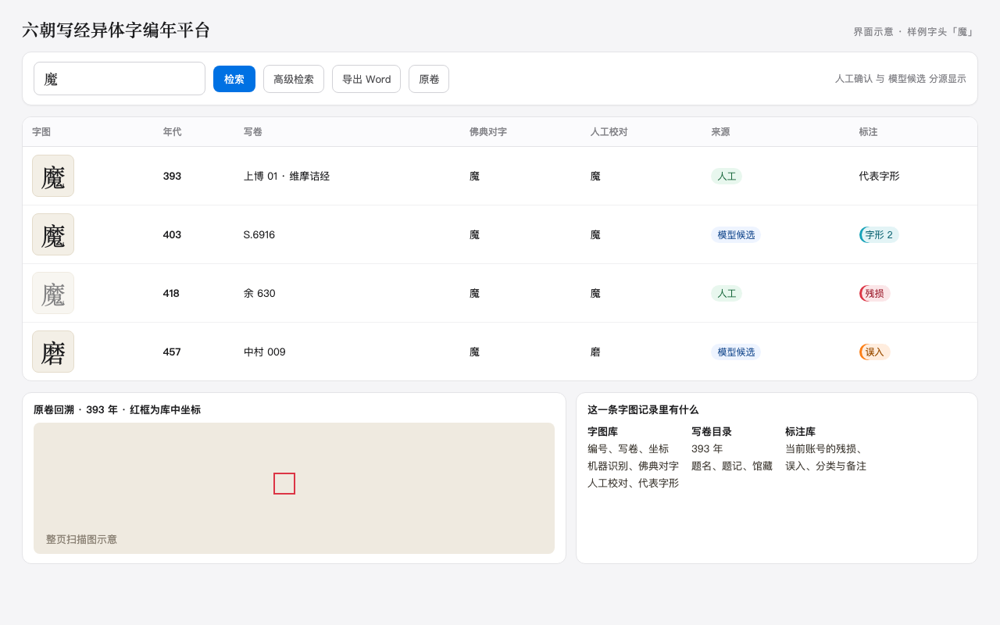
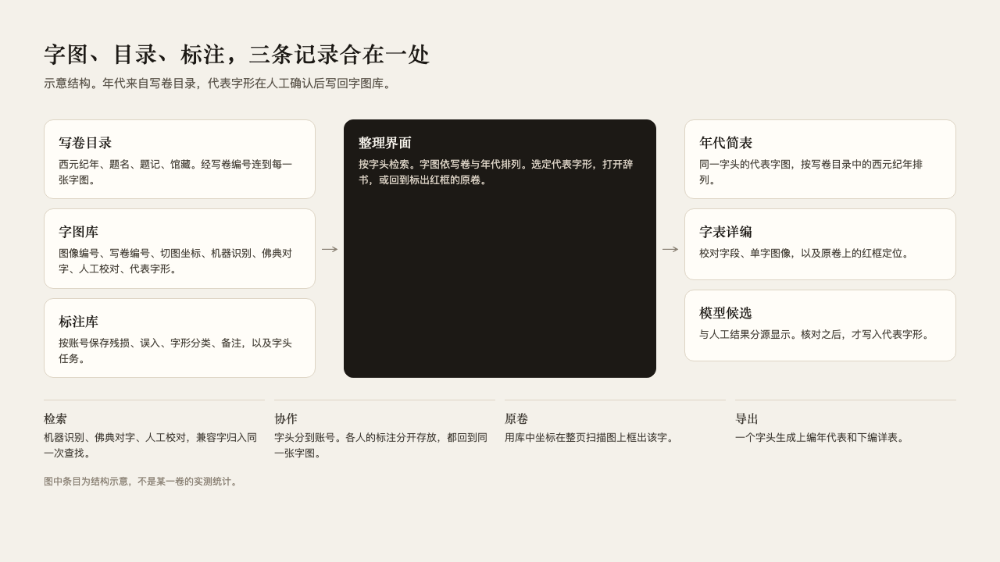

# 六朝写经异体字编年平台

这套程序把单字图像、写卷目录和协作标注连成一条整理流程。研究者按字头领取任务，在同一界面检索、比对、标注，确认代表字形后写回字图库，再按年代导出字表，并把单字还原到原卷上的位置。人工确认与模型候选分源存放。确认过的字形进入编年序列。

字图库沿用同一表结构时，分派、标注、写回、原卷回溯和出表可以在自备材料上完整运行。

整理界面以样例字头示意。年代、写卷和标注都是结构示例。



三条记录在界面汇合：写卷目录提供年代，字图库保存字形与坐标，标注库按账号记下整理结果。



## 可以做什么

**按字头组织协作。** 管理端把字头分到具体账号。每个人看到自己的任务，标注残损、误入、字形分类和备注。各账号的记录彼此分开，又通过图像编号回到同一张字图。

**确认代表字形。** 同一字头下选定代表字图，写入字图库，作为编年字表的依据。模型按「写卷加字头」给出候选，和人工结果分源显示。人工核对之后，该字图才成为代表字形。

**检索并回到原卷。** 检索覆盖机器识别、佛典对字和人工校对。兼容汉字与康熙部首归入同一次检索。点开一张字图，程序用库中坐标在整页扫描图上框出该字，便于看行款和上下文。字头之下可以对照辞书。

**按年代导出字表。** 一个字头可以导出为 Word。上编按写卷目录中的西元纪年排列字图，下编列出校对字段、单字图像，以及红框标出位置的原卷。导出时可以只取人工确认、只取模型候选，或先圈定若干写卷。

**按写卷回看材料。** 目录页汇总写卷的纪年、题名和字图数量。进入一卷，可以看到该卷里各字的字图；再进入某一个字，可以看到它在这一卷中的各张切图。

## 一次整理如何走完

1. 登录后进入任务列表，打开分配到的字头。
2. 字图按写卷排列。释文、坐标来自字图库，标注来自当前账号。
3. 选定代表字形并写回。需要核对时，调出辞书，或打开带红框的原卷。
4. 导出该字头的年代简表和详表。
5. 管理端继续分派下一批字头，并查看人工确认与模型候选的覆盖。

字图库记录图像编号、写卷编号、切图坐标、机器识别、佛典对字和人工校对。纪年、题名和题记在写卷目录里，经写卷编号与字图相连。标注、任务和日志另库存放。

## 程序对应

| 能力 | 程序 |
| --- | --- |
| 检索、标注、原卷回溯、字头导出 | `app.py`，主界面 `templates/workspace.html` |
| 登录与字头任务 | `templates/login.html`，`templates/dashboard.html` |
| 字图库 | `char_database.py` |
| 标注、任务与日志 | `database.py`，`data_helpers.py`，`annotation_lookup.py` |
| 写卷目录与卷内字图 | `templates/manuscripts.html` 及卷、字两级页面 |
| 分派任务，区分人工与模型 | `templates/admin.html`，`templates/admin_sources.html`，`templates/admin_coverage.html` |
| 辞书对照 | `dict_database.py` |
| 模型候选复核 | `ai_review_blueprint.py`，路径 `/ai_review` |

## 接入自己的材料

准备三样东西，即可跑通上面的流程：与本程序字段一致的字图库、与记录对应的单字图像目录、以及 `users.json` 中的账号。要在原卷上画框、并在字表里写上西元纪年，再接上原卷图像目录和写卷目录。

| 环境变量 | 接入内容 |
| --- | --- |
| `SIX_DYN_CHAR_DB` | 字图库，默认 `data/characters.db` |
| `SIX_DYN_STUDENTS_DB` | 标注与任务库，默认 `data/students.db` |
| `SIX_DYN_IMAGE_FOLDER` | 单字图像目录 |
| `SIX_DYN_ORIGINAL_FOLDER` | 原卷扫描图目录 |
| `SIX_DYN_CATALOG_XLSX` | 写卷目录，提供西元纪年、题名和题记 |
| `SIX_DYN_VARIANT_TABLE` | 异体对照表，默认 `data/variant.txt` |

辞书放在 `data/dictionaries.db`。账号放在 `users.json`。

```bash
pip install -r requirements.txt
export SIX_DYN_IMAGE_FOLDER="/path/to/character-images"
export SIX_DYN_ORIGINAL_FOLDER="/path/to/manuscript-pages"
export SIX_DYN_CATALOG_XLSX="/path/to/catalog.xlsx"
python3 app.py --port 5010
```

生产环境使用 `./start_server.sh 5010`。该脚本通过 `wsgi.py` 加载 `app.py`。
