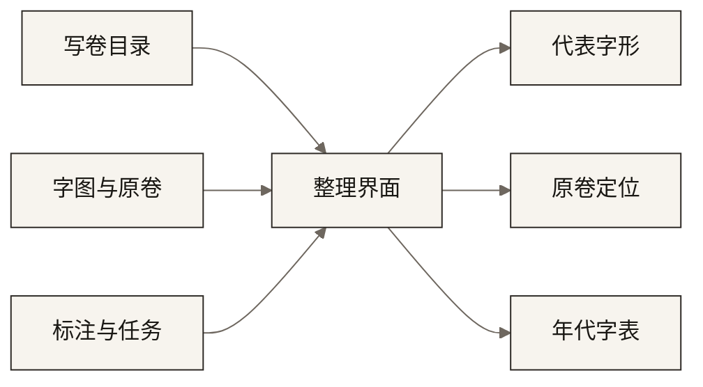

# 六朝写经异体字编年平台

写经单字、写卷目录与协作标注，收在同一条整理流程里。按字头检索，确认代表字形，回到原卷上的位置，并按年代导出字表。



## 功能

- **协作。** 字头分到账号。残损、误入、字形分类和备注按账号保存，经图像编号回到同一张字图。
- **代表字形。** 选定的字图写回字图库。模型候选与人工结果分源并列，核对之后进入编年序列。
- **检索与原卷。** 机器识别、佛典对字、人工校对可同时检索；兼容汉字与康熙部首归入一次查找。字图按库中坐标，在整页扫描图上框出。
- **年代字表。** 一个字头导出为 Word。上编按写卷目录的西元纪年排列，下编附校对字段、单字图像与红框原卷。
- **按卷回看。** 从目录进入某一卷、某一个字，查看切图、题名与题记。

同一表结构接入自备字图、目录与账号后，上述流程即可运行。

## 开始

```bash
pip install -r requirements.txt
export SIX_DYN_IMAGE_FOLDER="/path/to/character-images"
export SIX_DYN_ORIGINAL_FOLDER="/path/to/manuscript-pages"
export SIX_DYN_CATALOG_XLSX="/path/to/catalog.xlsx"
python3 app.py --port 5010
```

生产环境使用 `./start_server.sh 5010`。

| 环境变量 | 接入内容 |
| --- | --- |
| `SIX_DYN_CHAR_DB` | 字图库，默认 `data/characters.db` |
| `SIX_DYN_STUDENTS_DB` | 标注与任务库，默认 `data/students.db` |
| `SIX_DYN_IMAGE_FOLDER` | 单字图像目录 |
| `SIX_DYN_ORIGINAL_FOLDER` | 原卷扫描图目录 |
| `SIX_DYN_CATALOG_XLSX` | 写卷目录 |
| `SIX_DYN_VARIANT_TABLE` | 异体对照表，默认 `data/variant.txt` |

辞书为 `data/dictionaries.db`。账号写在 `users.json`。

## 程序

| 能力 | 位置 |
| --- | --- |
| 检索、标注、原卷、导出 | `app.py`，`templates/workspace.html` |
| 登录与字头任务 | `templates/login.html`，`templates/dashboard.html` |
| 字图库 | `char_database.py` |
| 标注、任务与日志 | `database.py` |
| 写卷浏览 | `templates/manuscripts.html` |
| 任务分派与来源 | `templates/admin.html`，`templates/admin_sources.html` |
| 辞书 | `dict_database.py` |
| 模型候选 | `ai_review_blueprint.py` |
